# Micro-CMS v1

## FLAG0 Solution 

When clicked to view the website, we are presented with this. 

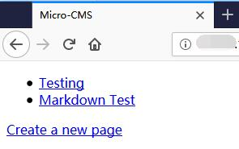

Since we are able to create a new page, a new page  is then created. 

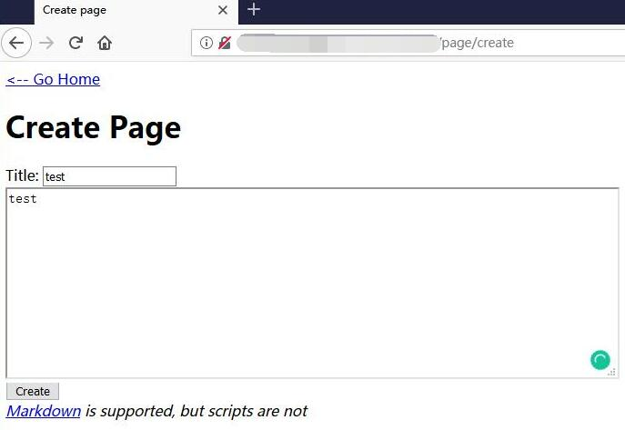

Once the webpage is created, it is noticed that the webpage is assigned to id 9. 
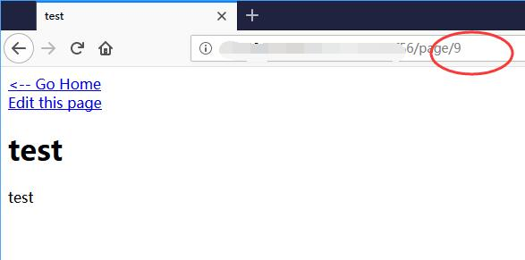

Since the webpage that I created has an id of 9, and the id is shown in the url, it means that we are able to navigate to other pages using the ids starting with 1 which shows a test page. 

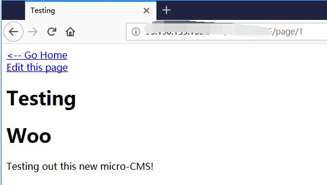

By checking the id of the webpage one by one, from 1-9, page 7 has 403 Fobidden error, which is different from the others which either shows a page or returns 404 Not Found. 

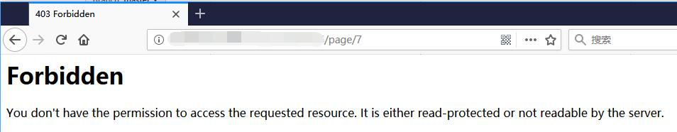

The website also allows user to edit the webpage. Using the test page we created previously, its noticed that the url changes from ```/page/9``` to ```/page/edit/9```
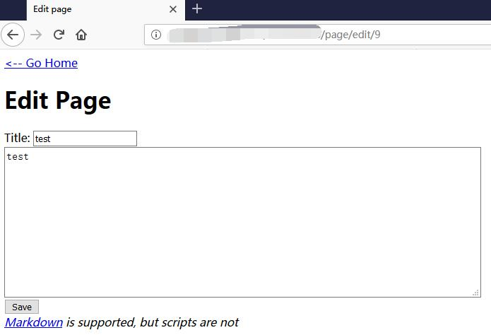

Therefore, by changing the page id to id 7, the FLAG is obtained. 

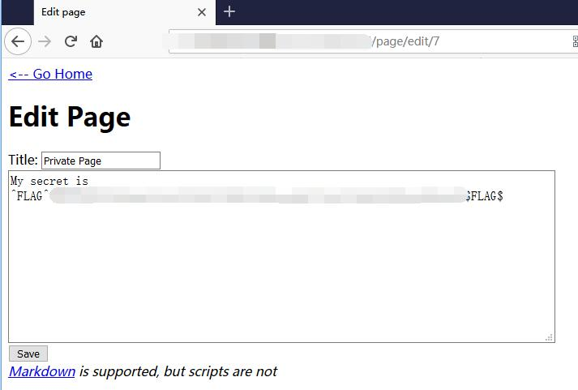

## FLAG1 Solution 

For the next flag, SQL injection(SQLi) was tested against the webpage. Since the previous flag is obtained in  the /page/edit directory, navigate to ```/page/edit/1``` to allow us to edit the page. 


SQLi is now tested on the url. 

```url: http://127.0.0.1:5001/xxxxxxxxxx/page/edit/1'```

The flag is obtained. 

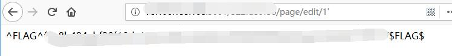

## FLAG2 Solution 

XSS is also tested against the webpage. Using the same page, ```/page/edit/1```, XSS injection is done on the ```Title``` section and the ```body``` section. 

```html command for XSS: 
<script>alert`xss`</script>
```

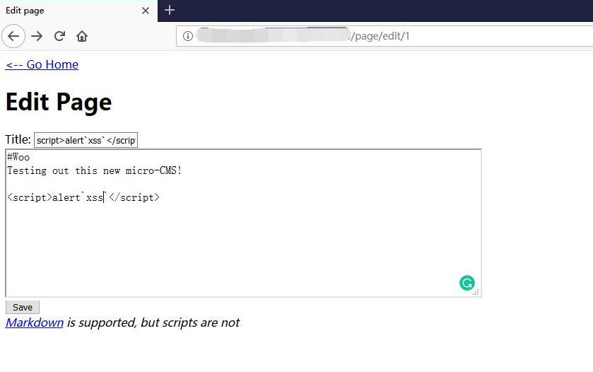

Once the page is saved. Nothing is shown. 

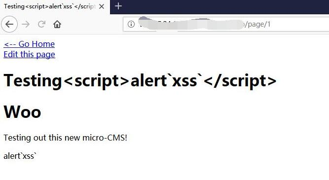

However, when we navigate back to the home directory, the flag is shown. 

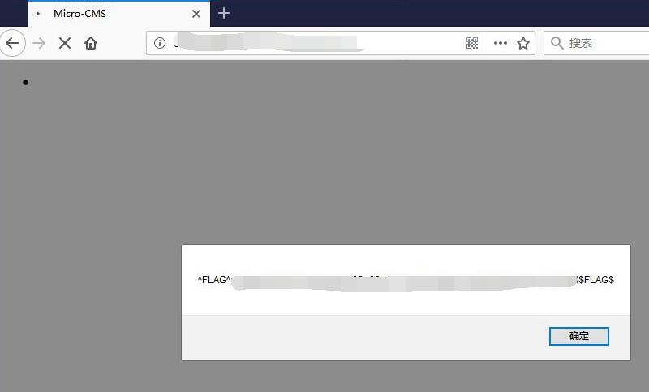

## FLAG3 Solution 

A markdown page is also found in the webpage. 


XSS injection is used against edit Page 2

```html XSS command: 
<button onclick=alert(1)>Some button</button>
```

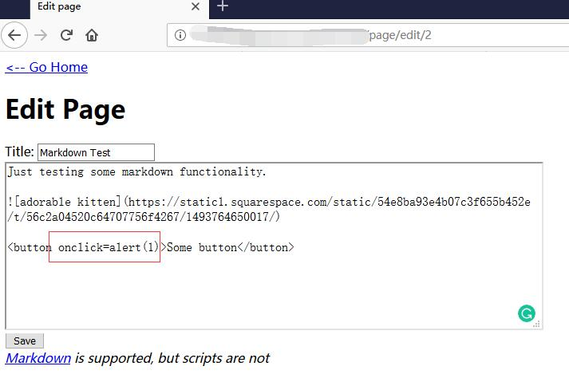

Save and nothing happened. 

However, the button may trigger an js event. 

Go check the html and get the flag.

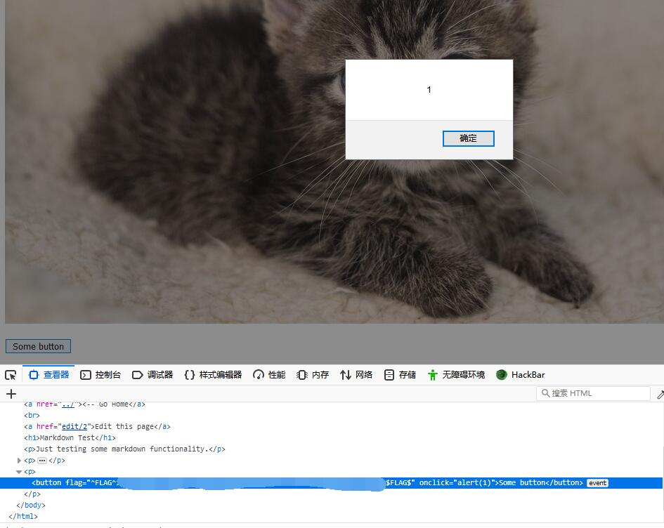