# Postbook

## FLAG0 Solution 

When clicked to view the website, we are presented with this.

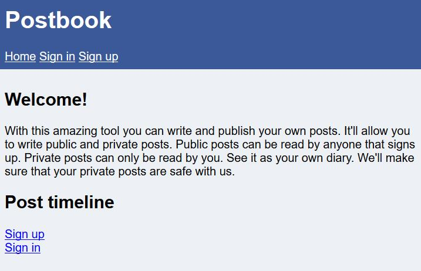

A weak login credentials is used to login successfully. 

```
username: user
password: password
```

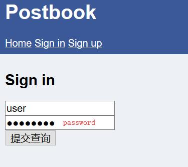

Once logged in, the flag is obtained. 

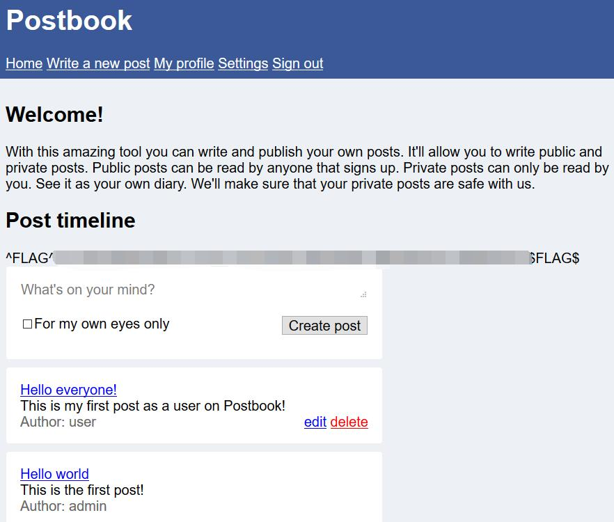

## FLAG1 Solution 

By clicking on the post, it is noticed that the id is changed.

```url: http://127.0.0.1/1234567890/index.php?page=view.php&id=1```

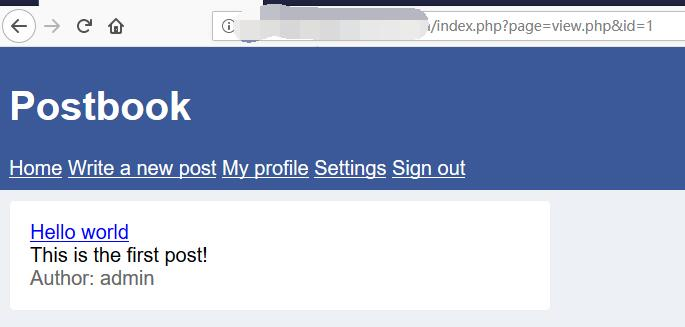

By changing the id to 2, the flag is obtained

```url: http://127.0.0.1/1234567890/index.php?page=view.php&id=2```

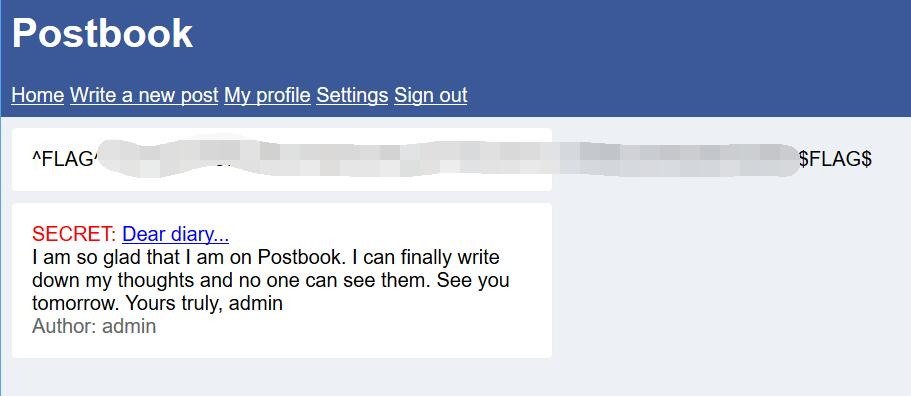

## FLAG2 Solution 

## 0x00 New Post

When looking at the source code of the post form, there is a hidden value showing **user_id = 2**.
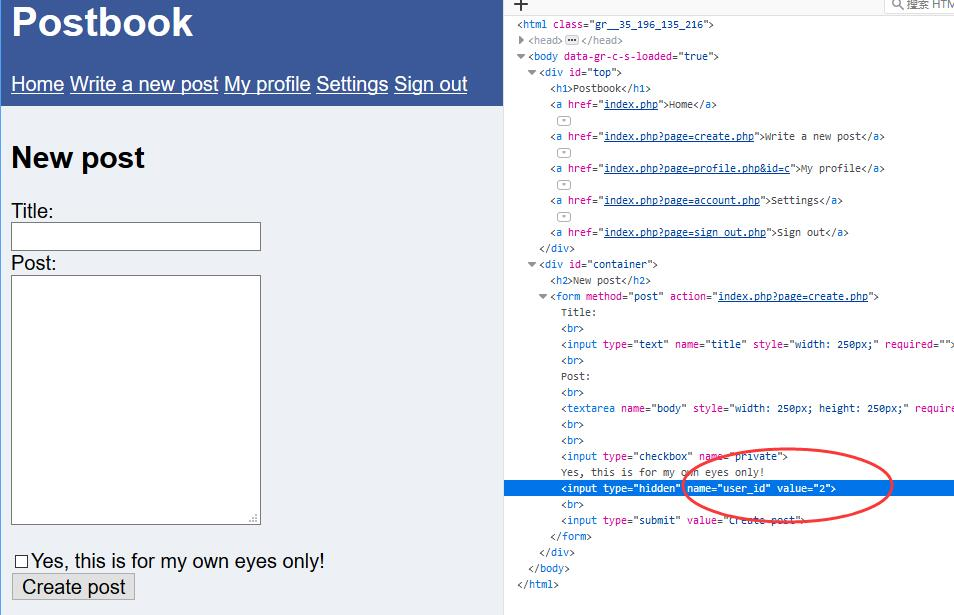

This would mean that by changing it to 1, it allow us to post as other people.

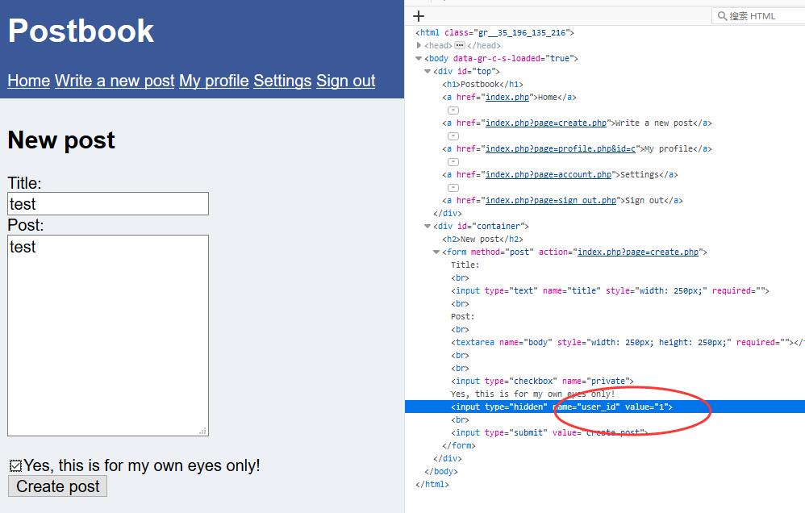

The flag is then obtained. 

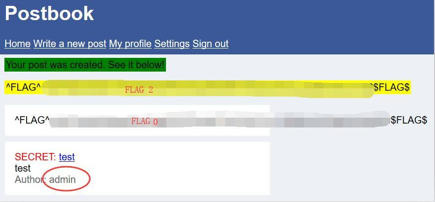

## FLAG3 Solution 

The id seems can be change to very large value (189 * 5 = 945).

```url: http://127.0.0.1/1234567890/index.php?page=view.php&id=945```

By changing the id to 945, the flag is obtained. 

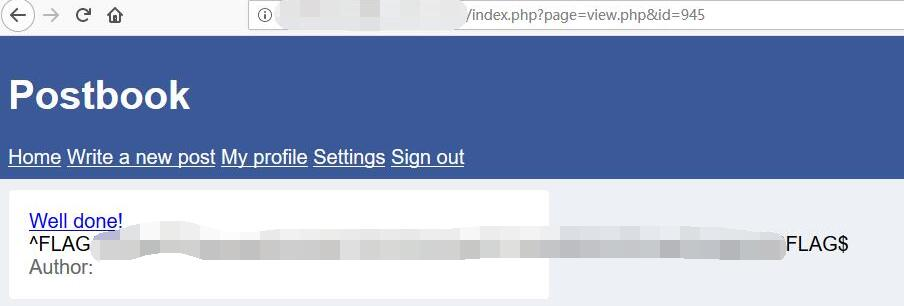

## FLAG4 Solution 

When editing the post, it is noticed that the id can be changed. 
```inital url: http://127.0.0.1/1234567890/index.php?page=edit.php&id=3```

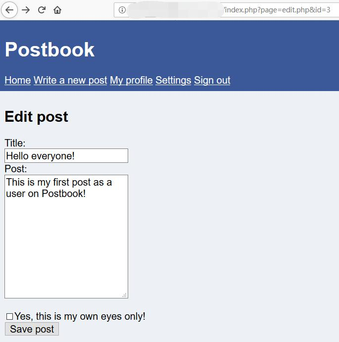

By changing the id to 1, it shows that it is possible to edit another user's post. 

```url: http://127.0.0.1/1234567890/index.php?page=edit.php&id=1```

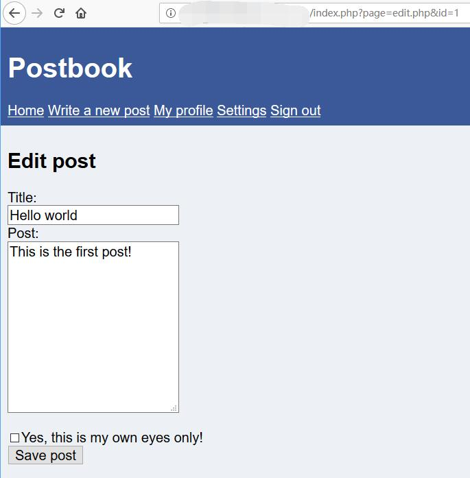

The result is then save and the flag is then obtained. 

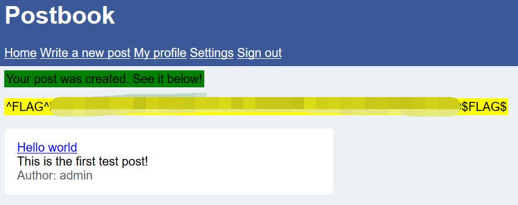

## FLAG5 Solution 

When the request is intercepted, the user cookie is found. 

```
id: "c81e728d9d4c2f636f067f89cc14862c"
```

Using [cmd5.com](https://www.cmd5.com/
), it is known that its the md5 value of 2.

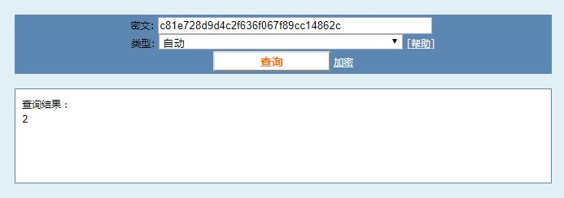

By encoding the value 1 into md5, we are able to login as admin. 

```
id of admin cookie in md5: "c4ca4238a0b923820dcc509a6f75849b"
```

Flag

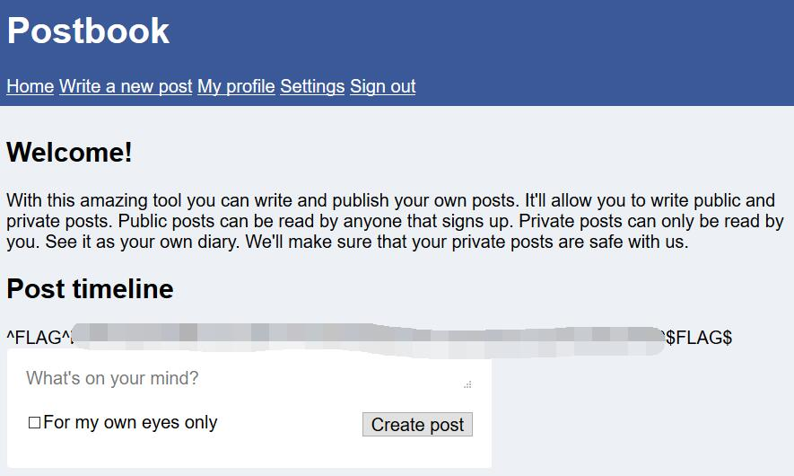


## FLAG6 Solution 

When the post is deleted, it is noted that the id of the user is included in the url. 
```url deleted: http://127.0.0.1/1234567890/index.php?page=delete.php&id=eccbc87e4b5ce2fe28308fd9f2a7baf3```

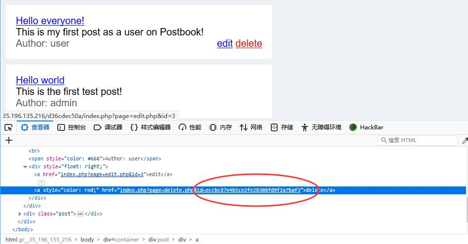

By changing the id to another value and encode it in md5, we are able to delete post by other user. 
```url: http://127.0.0.1/1234567890/index.php?page=delete.php&id=c4ca4238a0b923820dcc509a6f75849b```

The flag is then obtained.


